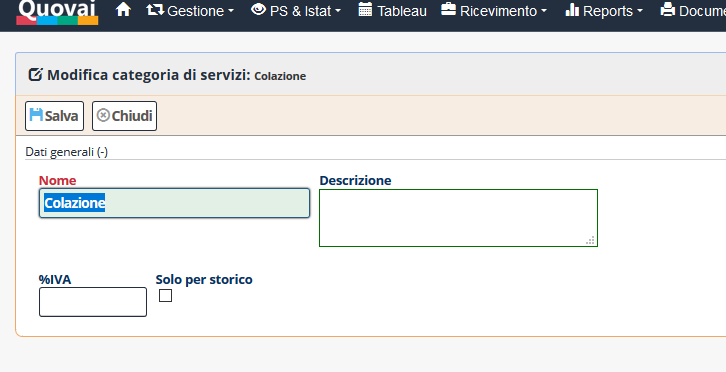

[Indice](index.md) / [Quovai PMS](quovai-pms-it.md) / Come rendere prenotabili i servizi extra

# # Come rendere prenotabili i servizi extra

Entrare nella sezione  **Configurazione** e clicca su **Struttura** 

Poi apre la struttura e clicca su **prenotazioni servizi** per rendere i servizi prenotabili

Salva e poi chiude la scheda.

Poi clicca di nuovo su **Configurazione** e  clicca su **Categorie di servizi**

Aggiungiamo, per esempio, colazione:

Salva e poi chiude la scheda.

Sempre su **Configurazione** clicca su **Servizi** per creare il servizio extra:

Inseriamo, per esempio, colazione continentale poi scegliamo la struttura e la categoria di servizio:

Salviamo e poi viene fuori il dettaglio sul prezzo:  

Per il nostro esempio, inseriamo 

 - Prezzo di base: 7 euro.
 - Periodicità: scelta fra giornaliero (significa che viene moltiplicata per tutta la durata del soggiorno) o a forfait
 - Venduto quantità: significa più copie dello stesso servizio – per esempio, potrebbe essere la colazione per più persone
 

Premeremo poi su **Salva**.

Poi passiamo alla **Traduzione Servizi**: 

Sceglie la lingua e aggiunge i testi corrispondenti: 

  
Salva e poi torniamo indietro sulla pagina principale dei servizi, selezioniamo **booking online aperto** e salviamo.

  