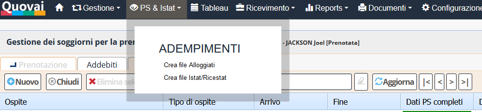

 [Indice](index.md) / [Quovai PMS](quovai-pms-it.md) / Schedine Alloggiati e ISTAT/RICESTAT

#  Schedine Alloggiati e ISTAT/RICESTAT

*[L'art. 109 del TULPS (Testo Unico delle Leggi di Pubblica Sicurezza)](https://questure.poliziadistato.it/statics/50/norme-tulps-_--cad-.pdf?lang=it) stabilisce che i gestori di esercizi alberghieri e di altre strutture ricettive, comprese quelle che forniscono alloggio in tende, roulotte, nonché i proprietari o gestori di case e di appartamenti per vacanze e gli affittacamere, ivi compresi i gestori di strutture di accoglienza non convenzionali, ad eccezione dei rifugi alpini inclusi in apposito elenco istituito dalla regione o dalla provincia autonoma, debbano comunicare giornalmente all'autorità di pubblica sicurezza l'arrivo delle persone alloggiate, mediante consegna di copia della scheda o comunicazione, anche con mezzi informatici, secondo modalità stabilite con decreto del Ministero Interno.*

Secondo la [Gazzetta Ufficiale](http://www.gazzettaufficiale.it/eli/gu/2013/01/17/14/sg/pdf), pagina 23 (tabella I), **la durata massima della permanenza è di 30 giorni**. 

Prima di inviare le Schedine Alloggiati e le statistiche alle autorità , devi aver [compilato le schede di soggiorno](inserimento-soggiorni-it.md) per gli ospiti (sotto Tableau > modifica prenotazione > Soggiorni).

Per inviare le Schedine Alloggiati al portale **Alloggiati della Polizia di Stato**, si può cliccare sulla voce di menu `PS & ISTAT`:

Viene proposto, come default, la data odierna che può essere cambiata per elaborare gli alloggiati di di altre date (in realtà solo del giorno precedente, in quanto non sarebbe possibile effettuare la comunicazione di date anteriori):

 
Verrà  generato automaticamente un file **.txt** che potrà essere caricato facilmente sul portale **Alloggiati**:

[https://alloggiatiweb.poliziadistato.it/Alloggiatiweb/](https://alloggiatiweb.poliziadistato.it/Alloggiatiweb/)
 
*Le strutture ricettive, ENTRO LE 24 ORE successive all'arrivo, devono comunicare alle questure territorialmente competenti, ESCLUSIVAMENTE per il tramite del Servizio Alloggiati, le generalità delle persone alloggiate. Se il soggiorno è inferiore alle 24 ore le generalità vanno inviate all'arrivo stesso.
 
Per generare invece il file da inviare sulla piattaforma ISTAT/RiceStat (piattaforma online per la compilazione dei dati statistici), potrai cliccare sulla voce di menu `Crea file Istat/Ricestat`.

Dovrai inserire le date (che di solito vengono pre-compilate all'inizio e alla fine del mese precedente) e cliccare su `Crea file`. Verrà generato un file **.xml** che potrà essere salvato (ad esempio sul desktop o in una cartella dedicata) e caricato sul portale provinciale di competenza.

Dopo avere effettuato la procedura indicata ci si collega al portale Ricestat  con le credenziali in proprio possesso e si invia il file tramite la sezione "File presenze". 

Il nostro piano per 2019 è di permettere l'**invio telematico** delle Schedine Alloggiati e delle statistiche direttamente dal PMS Quovai.
