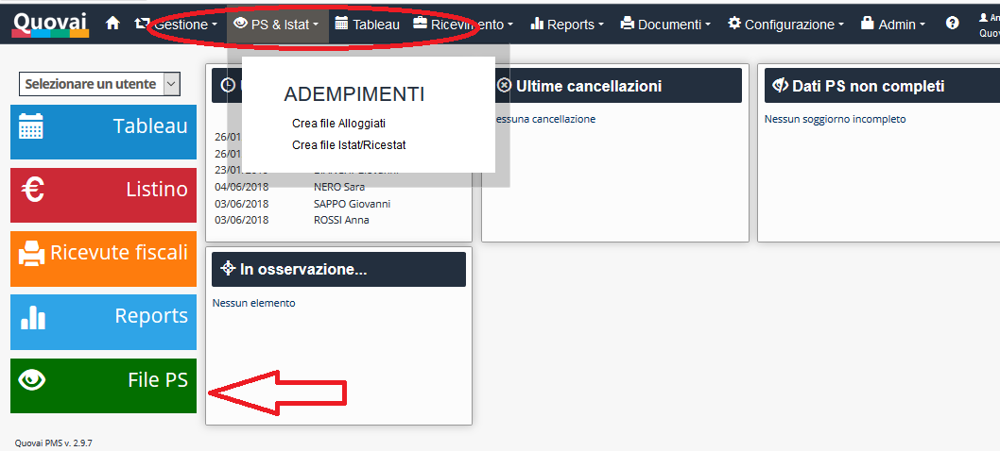
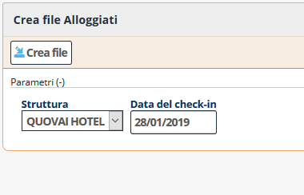
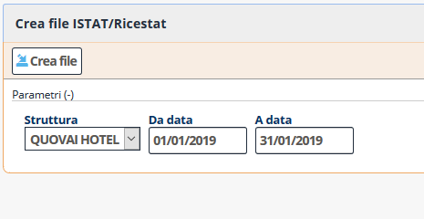

 [Indice](index.md) / [Quovai PMS](quovai-pms-it.md) / Schedine Alloggiati e ISTAT/RICESTAT

#  Schedine Alloggiati e ISTAT/RICESTAT
  
Prima di inviare le Schedine Alloggiati e le statistiche, devi aver compilato le schede per gli ospiti (sotto Tableau > modifica prenotazione > Soggiorni).

Per inviare le Schedine Alloggiati al portale **Alloggiati della Polizia di Stato**, devi cliccare sul bottone PS & ISTAT:

Ti propone di default il giorno di oggi ma è anche possibile cambiarlo per elaborare gli alloggiati di ieri:

 
Verrà generato un file **.txt** che può essere caricato sul portale:

[https://alloggiatiweb.poliziadistato.it/Alloggiatiweb/](https://alloggiatiweb.poliziadistato.it/Alloggiatiweb/)

*Ricordiamo che il sito della Polizia di Stato accetta l’upload solo degli arrivi **del giorno corrente o
delle 24 ore precedenti.***

Per inviare i dati ISTAT/RiceStat (piattaforma online per la compilazione dei dati statistici), devi inserire il mese dal...al poi verrà generato un file **.xml** che può essere caricato sul proprio portale regionale.

Il nostro piano per 2019 è di permettere l’**invio telematico** delle Schedine Alloggiati e delle statistiche direttamente dal PMS Quovai.