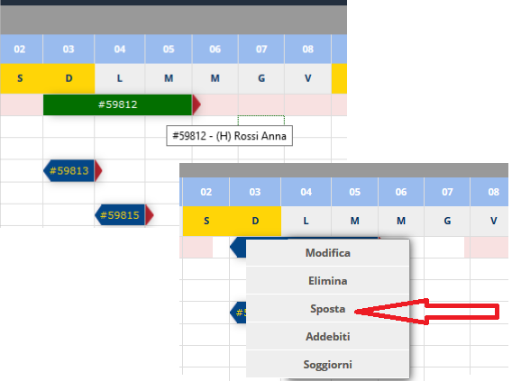
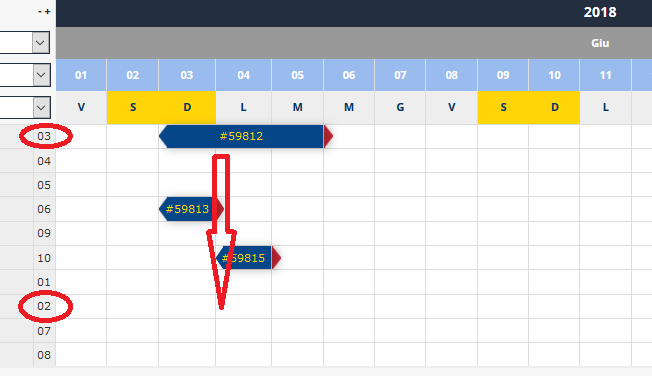
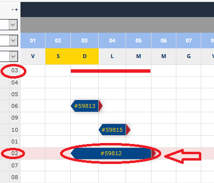

[Indice](index.md) / [Quovai PMS](quovai-pms-it.md) / Come spostare una prenotazione

# Come spostare una prenotazione

Per spostare una prenotazione nel tableau (da una camera/un appartamento all'altra/o sempre per lo stesso periodo), devi evidenziare la prenotazione mettendo il mouse sopra la prenotazione (cambia colore e diventa verde scuro).

Una volta evidenziata, clicca il tasto sinistro del mouse e viene mostrato un menu che contiene tra le altre la voce Sposta.

Per spostare la prenotazione #59812 dalla camera 03 alla camera 02:

Clicca su Sposta e dopo pochi istanti sparisce la prenotazione. Mette il mouse sulla riga della camera/dell'appartamento di scelta e viene inserita automaticamente.

